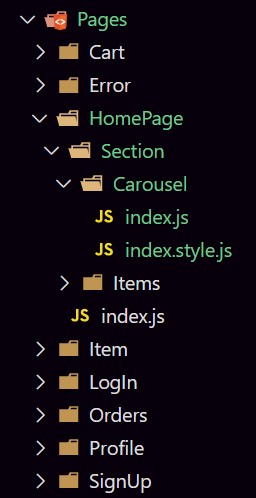
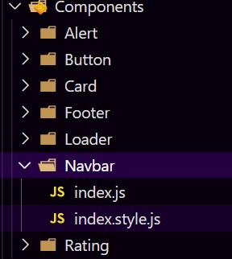

# Crop Sell Management

 
 
 

## Modules use

* <a href="https://styled-components.com/docs">Styled-Components</a> <b>Ref : <a href="https://www.youtube.com/playlist?list=PLrFj9Rc7YqyzSavcAqXC_hSoGPcIRI_1q">Code-with-Bhargava</a></b>
* <a href = "https://mdbootstrap.com/docs/">MDBootstrap</a>
* <a href = "http://react-toolbox.io/#/components">React-Toolbox </a>
* <a href = "https://designrevision.com/docs/shards-react/getting-started">Shards-react</a>
* <a href = "https://react-icons-kit.vercel.app/">React-Icons-Kit(Icons)</a>
* <a href = "https://ant.design/components/overview/">Ant-design</a>
* <a href= "https://react.semantic-ui.com/">Semantic-UI</a>
* <a href = "https://material-ui.com/getting-started/usage/">Material-UI</a>
* <a href = "https://react-slick.neostack.com/">React-Slick(Carousel)</a>
* <a href = "https://picsum.photos/">Random-Image(https://picsum.photos/\${width}/${height})</a>
* <a href = "https://reactrouter.com/web/guides/quick-start">React-Router-Dom</a>
  

 
 
 

## Folder Structure

